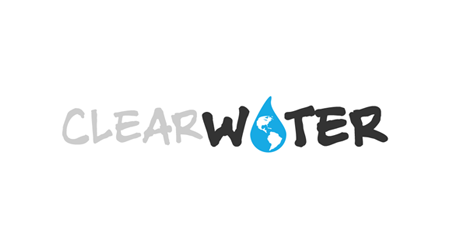
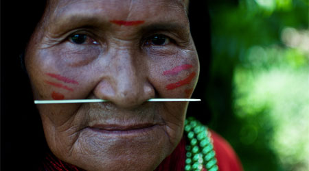

### Rise 
## Become a Champion

Become a ClearWater Champion and give 100% to clean water solutions in Ecuador. Build your personal Champion page and goal, crowdsource the fundraising through networks and friends, and GO applies 100% of donations to ClearWater and then your friends see the direct impact on the ground.

[Become a Champion](http://www.groundworkopportunities.org/become-a-clearwater-champion/)

### learn
## The Vision

ClearWater is a community-led clean water project which seeks to provide sustainable clean water to more than 2,000 indigenous and farmer families spread across 20 villages in the oil-ravaged areas of the northeastern Ecuadorian Amazon.

[ClearWater Project](project)

### Champion 
## Rea Garvey

In June of 2011, I had the great opportunity to journey to the heart of the Ecuadorian Amazon, where I met Donald Moncayo. Donald is a father and a son and a husband. He lost his own mother due to cancer and he, as well, suffers from respiratory problems. Donald knows that his own wife and daughter will, sooner or later, be victims of the contamination.

[Rea Garvey](rea)
